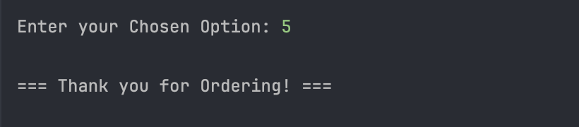

# Mini Capstone: Pizza Ordering

Submitted by: Christopher Bayquen | July 2, 2025

This repository holds our submission for our second asynchronous task for our Java Fundamental Sessions. For this activity we were tasked to accomplish a Mini Capstone project: an ordering system for a pizza shop where customers can place, update, list, and remove pizza orders. Validations are made for each of the user input for all of the functionality of the program. 

### Input/Output :

**Valid Input: Adding Orders**

**Valid Input: Updating Orders**

**Valid Input: Viewing Orders**

**Valid Input: Removing Orders**

**Valid Input: Exiting**

**Sample Invalid Inputs**

### Output Validation Cases:

